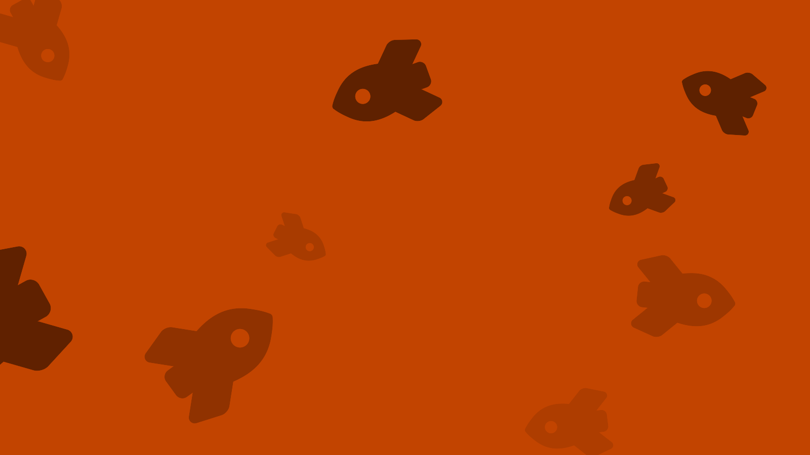

# happybackgrounds

This is a script for generating simple wallpapers and backgrounds by splattering icons from Font Awesome over a solid block of colour.
Some examples:

<table>
    <tr>
        <td></td>
        <td></td>
    </tr>
    <tr>
        <td></td>
        <td></td>
    </tr>
    <tr>
        <td></td>
        <td></td>
    </tr>
</table>


## Usage

You need Python 3 installed.
Clone the repo, and run the "happybackgrounds" script to see how it can be used:

```console
$ git clone https://github.com/alexwlchan/happybackgrounds.git
$ cd happybackgrounds
$ python3 happybackgrounds.py --help
```

You can choose:

*   the background colour
*   the icon to use
*   how many icons to show, and how big/small to make them

The script [`run.sh`](run.sh) has the invocations that generated the examples in the table above.

The script returns the path to the generated SVG file, or you can specify the output file with the `--out_path` flag.
For example:

```console
$ python3 happybackgrounds.py --background="#d6fcff" --icon_name="snowflake"
/var/folders/_c/h0g4c9_n6rg8d2v509hztzdc0000gn/T/tmpfo3v6nqr.svg
```

You can convert these SVGs to PNGs using ImageMagick (as was done for the table above).


## Known limitations

Right now I run the script repeatedly until I get a "nice-looking" result; the success rate is nowhere near good enough to drop this into an automated process.

*   The script isn't very smart about where it places icons.
    Sometimes they overlap, sometimes they disappear outside the viewbox.

    Better awareness of where icons are, and spacing them nicely, would improve the success rate dramatically.
    This also seems hard, so I skipped doing that for the initial attempt.

*   The choice of colours is sometimes good, sometimes not-so-good.
    It's hard to know how to pick "good" colours.
    Sometimes a lot of variety is good (e.g. with the Mars rockets), other times having them close together is better (e.g. the stars).


## License

CC0.
